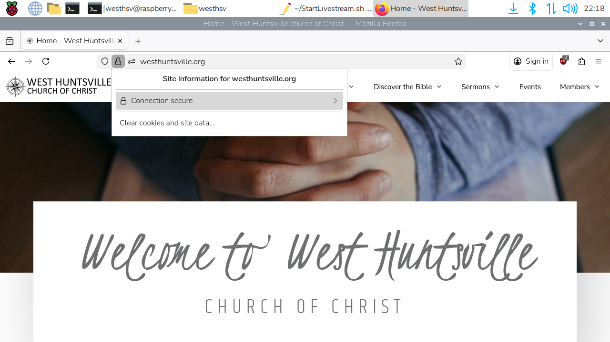
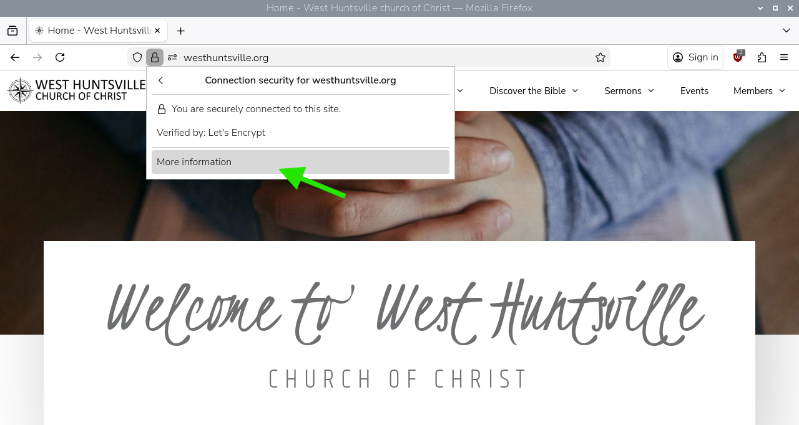
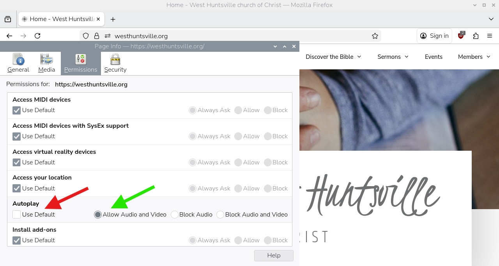

# LivestreamDevice
Raspberry Pi Kiosk for non-interactive Livestream viewing

## Install Raspian OS
1. Download the Pi installer from [https://www.raspberrypi.org/software/](https://www.raspberrypi.org/software/)
1. Install Raspberry Pi (32-bit for 3B+, 64-bit for later versions) on a 4GB or larger SD Card

## Boot Livestream Device
1. Boot your Raspberry Pi 3B+ or later with the SD Card inserted
1. Setup your WiFi or connect a wired ethernet cable
1. Click the ">_" icon next to the Pi menu in the top left of the desktop
2. Run "sudo raspi-config"
3. Choose "Advanced Options"
4. Choose "Wayland"
5. Choose "X11"
6. Exit the program by pressing escape until it exits
7. Reboot

## Set Resolution
1. Set Resolution to 1280x720 (or other resolution if that fails)
   * You may be able to get 1920x1080 to play smoothly on a Raspberry Pi 4 or later, but make sure to change the mousemove locations in CheckForRefresh.sh
1. Open the Pi menu in the top left of the desktop
1. Preferences -> Control Center
1. Screens -> Screens -> HDMI-1 -> Resolution -> 1280x720
1. Apply -> Close

## Set the Audio Device
1. Right click the audio icon in the taskbar
2. Select the HDMI output

## Set Background Picture
1. Open the Pi menu in the top left of the desktop
1. Preferences -> Control Center
1. Desktop -> Picture
1. Select your chosen background
   * In the case of WestHSV CofC ==> /home/pi/Pictures/WestHuntsville.png
1. Open
1. Uncheck Wastebasket
1. Uncheck Mounted Disks
1. Close

## Install Support Software
Ensure that xdotool and unclutter are installed
1. Click the ">_" icon next to the Pi menu in the top left of the desktop
1. Type the following:
   * sudo apt-get install xdotool unclutter
   * y
   * exit

## Set Firefox to Allow Video Streaming
1. Navigate to the website where your embedded video is located as well as the video hosting site and perform the following
1. Click the lock icon
1. Click the connection security menu 
1. Click `More information` 
1. Select the `Permissions` tab
1. Under `Autoplay`, uncheck `Use Default` and select `Allow Audio and Video` 

## Download this repository
1. Download this repository
2. Open the archive
3. Extract the files into the home directory

## Modify for Your Livestream
If you are not building for WestHSV CofC, modify the livestream link in `StartLivestream.sh` on the last line to your indirect livestream link.
*  ~~Alternatively, if you do not host an indirect link to your livestream, you can comment out the last line in `StartLivestream.sh` and uncomment the second to last line and change the link inside `temp.html` to your direct link.~~ Due to migration to encrypted websites across the internet, temp.html no longer functions

## Prep for distribution
1. Reboot the device
2. If everything loads correctly, shutdown the device
3. Take the SD card to a computer and save a backup (Use Win32Imager on Windows or dd on Linux, or your favorite alternative)
4. Replace the SD card in the device or write a new one and use it
5. When installing the device on site, remember to bring a keyboard and mouse so you can enter the WiFi passphrase if needed
